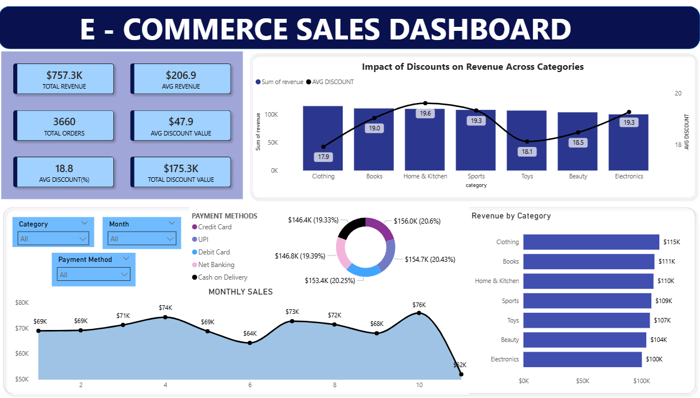

# 📊 E-Commerce Sales & Customer Analytics

## 🔍 Project Overview

This project presents an end-to-end analysis of an e-commerce dataset using **SQL, Python, and Power BI**. The objective is to extract meaningful business insights related to **revenue performance, discount strategies, customer behavior, and sales trends**.

The workflow covers data cleaning, feature engineering, exploratory data analysis (EDA), customer segmentation, and interactive dashboard creation.

---

## 📸 Dashboard Preview

---

## 🎯 Objectives

* Analyze overall sales performance and revenue trends
* Evaluate the impact of discounts on revenue
* Identify top-performing product categories
* Understand customer purchasing behavior
* Build an interactive dashboard for business decision-making

---

## 🛠️ Tools & Technologies

* **Python** (Pandas, NumPy, Seaborn, Matplotlib, Scikit-learn)
* **MySQL** (Data querying and aggregation)
* **Power BI** (Dashboard and visualization)

---

## 📂 Dataset Description

The dataset consists of transactional e-commerce data with the following key features:

* `user_id` – Unique customer identifier
* `product_id` – Product identifier
* `category` – Product category
* `price_rs` – Original price
* `discount_` – Discount percentage
* `final_pricers` – Final price after discount
* `payment_method` – Mode of payment
* `purchase_date` – Transaction date

### 🧪 Feature Engineering

Additional features created:

* `revenue` → Final transaction value
* `discount_value` → Price reduction amount
* `month`, `year` → Time-based features

---

## 🧹 Data Processing

* Cleaned column names and handled missing values
* Converted date formats to datetime
* Removed duplicates
* Standardized data for analysis

---

## 🧠 Analysis & Methodology

### 1️⃣ SQL Analysis

Performed structured queries to extract:

* Total revenue and total orders
* Revenue by category
* Monthly sales trends
* Payment method distribution
* Top customers

---

### 2️⃣ Exploratory Data Analysis (EDA)

Used Python for:

* Revenue distribution analysis
* Category-wise performance
* Payment behavior analysis
* Discount vs revenue relationship
* Correlation analysis

---

### 3️⃣ Customer Segmentation (K-Means)

* Grouped customers based on:

  * Revenue
  * Purchase frequency
  * Discount behavior
* Applied scaling and K-Means clustering
* Segmented users into:

  * High-value customers
  * Medium-value customers
  * Low-value customers

⚠️ Note: Dataset contains mostly single purchases per user, limiting frequency-based insights.

---

### 4️⃣ Power BI Dashboard

Built an interactive dashboard including:

* KPI cards (Revenue, Orders, Discounts)
* Monthly sales trend
* Revenue by category
* Payment method distribution
* Discount impact analysis

---

## 📊 Key Insights

### 💰 Revenue Insights

* Total revenue is approximately **$757K**
* Average order value is around **$206**

---

### 🛍️ Category Insights

* Revenue is evenly distributed across categories
* **Clothing** is the top-performing category

---

### 💳 Payment Insights

* Digital payment methods dominate transactions
* No single payment method overwhelmingly dominates

---

### 📉 Discount Insights (Important)

* **Low discounts (0–10%) generate the highest revenue**
* High discounts (>30%) significantly reduce total revenue
* Increasing discounts does not proportionally increase sales
* Indicates **diminishing returns on aggressive discounting**

---

### 📈 Sales Trend Insights

* Moderate fluctuations across months
* Peak observed around Month 10
* Sudden drop in later months

---

### 👥 Customer Insights

* No repeat purchase behavior observed
* Customer segmentation is primarily based on spending
* High-value customers contribute disproportionately to revenue

## 🚀 Future Improvements

* Add RFM (Recency, Frequency, Monetary) analysis
* Include profit margin analysis
* Integrate real-time data pipeline
* Enhance customer segmentation with more behavioral features

---

## 💯 Conclusion

This project demonstrates how combining SQL, Python, and Power BI can provide actionable insights into business performance. It highlights the importance of **data-driven decision-making**, especially in pricing and discount strategies.

---

## ⭐ If you found this useful, consider giving it a star!
